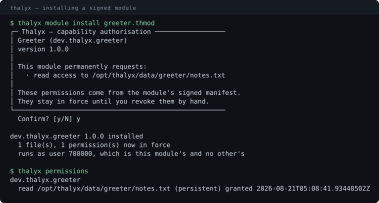
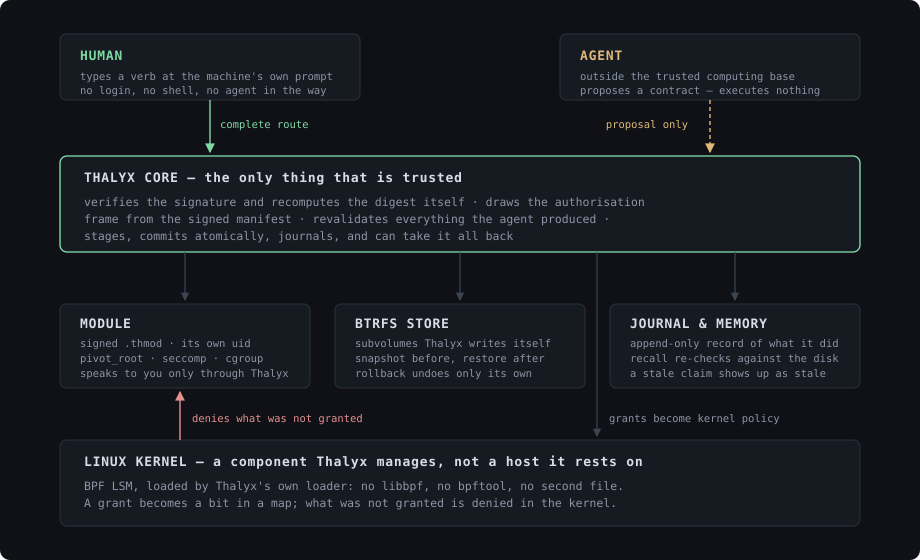
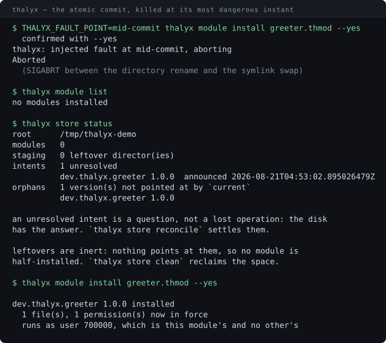

# Thalyx

An operating system where the AI is a first-class citizen rather than an
application — and where the human keeps a complete route that never goes through
it. The Linux kernel is a component Thalyx manages, not a host it rests on.



<sup>A real run, not a mock-up. That frame is drawn by the core from the
module's **signed** manifest — the agent cannot compose it, reword it, or show
you a subset of it. Raw capture:
[`docs/media/authorisation.txt`](docs/media/authorisation.txt); every image on
this page has one next to it.</sup>

**[Léelo en español →](README.es.md)** · **[What is proven, and what is not →](docs/STATUS.md)**

---

## Why it exists

On Windows, Linux and macOS an AI agent is a **guest**. To do anything it has to
pretend to be a human: drive a keyboard and mouse, or call APIs that are a
tracing of human interaction. Permissions were designed for human processes, the
scheduler for human workloads, the filesystem for human hierarchy. Every one of
those is a ceiling on what an agent can do fluently, and none of them can be
lifted from inside an application.

Thalyx inverts the relationship:

> **Thalyx is the operating system.** No intermediate layers, no distributions
> — nothing that is not Thalyx. If Linux disappeared, Thalyx would find another
> engine. If Thalyx disappeared, there is no system.
>
> — `vault/01-Filosofia/Filosofia-Fundacional.md`

That is a decree, and part of it is a *destination* rather than a description.
What is true today is written where it can be checked:
[docs/STATUS.md](docs/STATUS.md).

The OS is built around the agent — and the second half of that sentence is the
half that constrains everything:

> **Everything the agent can do, a human can do directly**, without the agent
> and without losing capability. An OS where the AI is the only way to get
> things done is a worse OS, not a better one.

That is the *double route*, and it has a consequence the whole design answers
to: Thalyx never has complete knowledge of its own filesystem, because you are
free to change things behind its back, so no destructive operation is allowed to
assume it does.

## The agent is not trusted

If you take one idea from this repository, take this one.

The agent sits **outside the trusted computing base**. It cannot execute
anything directly, cannot compose the prompts you authorise against, and cannot
let untrusted text it has read decide what happens. The core revalidates
everything it produces.

The frame at the top of this page is that rule made concrete: what you authorise
is composed by the core from a signed manifest, never by the thing asking. Most
systems that put an LLM near a shell are one prompt injection away from
disaster. Thalyx is built
on the assumption that the model **will** eventually be talked into trying
something, and arranges for that to be survivable.

## How it fits together



A grant is not a promise the userspace keeps to itself. It becomes a bit in a
BPF map, loaded by Thalyx's own loader — no libbpf, no `bpftool`, no second file
on the disk — and what was not granted is refused inside the kernel. A module
gets its own uid, its own root filesystem, a seccomp filter and a cgroup, and it
has no terminal: everything it says to you arrives through Thalyx, labelled,
because it cannot print to your screen.

## Claim → evidence

The project's working rule is that a claim you cannot check is not a claim. Each
of these has a command:

| Claim | How you check it |
|---|---|
| The image is the Linux kernel and **one** program | `make -C image count` — it prints the number, and if it ever says two the founding decree is broken |
| A bundle whose signature does not verify is refused | `thalyx dev inspect <bundle>` prints `signature valid` or `INVALID`; the core recomputes the artifact digest rather than believing the manifest |
| Permissions are shown by the core, from the signed manifest, before anything is installed | the image at the top of this file — `thalyx module install`, answer `n` and nothing is installed *and nothing is remembered* |
| The install survives being killed at its most dangerous instant | [`docs/media/atomic-commit.svg`](docs/media/atomic-commit.svg) — `THALYX_FAULT_POINT=mid-commit`, then `thalyx store status` |
| The kernel denies what was not granted | `make -C lsm demo`, on a kernel with `bpf` in its LSM order |
| Everything else, on hardware that can run it | `sudo ./dev/verify.sh` — every check reported `PROVEN` / `NOT PROVEN` / `FAILED`, never counted as a pass unless it ran |
| The six-step walkthrough works from a cold boot, unattended | stage 16 of `verify.sh` types it into a real machine |
| Nothing that could not be checked is counted as a pass | `verify.sh` prints `NOT PROVEN` with the reason, and lists them again in the summary |



<sup>The atomic commit, killed with `SIGABRT` between the directory rename and
the symlink swap. No unwinding, no cleanup. Nothing is half-installed, the store
says exactly what it is holding, and the retry succeeds. Raw capture:
[`docs/media/atomic-commit.txt`](docs/media/atomic-commit.txt).</sup>

## Where it actually stands

Honest short version. The long one, with dates and what each check covered, is
in **[docs/STATUS.md](docs/STATUS.md)**.

**Proven, on real hardware.** On 2026-08-07 a PC booted Thalyx from USB through
its own firmware, used HDMI and a real xHCI keyboard, listed its disks,
installed itself onto a second disk, and booted again without the installation
medium. That closed Phase 1. The most recent run of `verify.sh` on that machine,
on 2026-08-25, reported **156 proven, 2 not proven, 0 failed**. The kernel side
is proven: the LSM denies a real network connection to a process that lacks the
permission and only to that process, a module runs confined, Thalyx attaches its
own LSM with no `bpftool`, the kernel mounts a Btrfs filesystem Thalyx wrote
byte by byte with no `mkfs.btrfs`, and the mutation ring buffer is mapped and
drained from a real kernel pin.

What that number is not is a score. A count that moves says nothing until you
know which checks ran: the run before it reported 134 on a machine with no
kernel built, where the stage that boots it in QEMU — thirteen checks —
contracted into a single `NOT PROVEN` line. A marker and the lines under it are
one result, and the two lines this run could not establish are named in its own
summary rather than here. See [docs/STATUS.md](docs/STATUS.md).

**Built and covered by over 1,300 tests**, including fault injection that kills
the real binary at each point of the atomic commit, and end-to-end runs of the
whole six-step walkthrough. `cargo test --workspace` runs all of it.

**Partly proven.** The conversational agent has a model — `llama.cpp` invoked as
a process, four decreed tiers — and three of the four were measured on one
machine. The largest was killed for running out of memory before its first
inference finished, which is recorded as *no measurement*, not as a score of
zero. Bigger than that: **no tier abstained even once**. Every ambiguous
utterance produced a module id instead of a request for clarification, and the
decree calls abstention the most important measurement, so that is the largest
open result in the project. The grammar does not help — it constrains the
*shape* of an answer, never its truth.

**New, and proven only in part.** Thalyx can now run a program nobody signed.
`ejecutar <ruta>` confines a foreign binary exactly the way it confines a module
— its own cgroup, its own user, a pivoted root, the same syscall filter — and
gives it **no channel to Thalyx's API and no unconfined mode**, because the
signature that justifies both is what a guest does not have. It sees its own
directory, the read-only system paths, and whatever `leyendo`/`escribiendo`
named and a human confirmed at the terminal. That was the point blocking the
project's own bar, which is a foreign agent working here. What is proven so far
is everything around the run — the rehearsal, the refusal when the human says
no, the journal calling it `run_foreign`, the structured face declining to
consent on a human's behalf. What a confined guest can *see* needs a machine
with the LSM attached, and is `NOT PROVEN` until the next run there.

The first thing that verb ever said on real hardware found a hole. "The kernel
policy map is not loaded" was the right refusal, and the remedy it named —
`make -C lsm load` — lands a machine in **observe mode**, where every hook runs,
every denial is written to a ring, and none of them is applied. So the one
action the system asked for left the machine in the state where a guest would
have run and the kernel would have denied it nothing. `is_available()` answers
"does the policy map open"; nothing on this side had ever read the map that says
whether a denial is real. Now a guest is refused there too, a module runs but
the journal calls it degraded, and `thalyx enforce status` says which mode the
machine is in.

**Not proven.** `thalyx_watch` — the filesystem watcher, ten BPF hooks against
the LSM's two — has never been loaded by Thalyx's own loader; `bpftool` still
loads it, and *likely the same loader works* is not *proven*. An internal disk
has never received an installation, and no machine with an NVMe device has been
tried. Anything else the last run could not exercise is named in its own summary
as `NOT PROVEN`, with the reason.

**And one contradiction, published rather than hidden.** The founding decree says
modules speak to Thalyx exclusively through its API. Today a module is a
dynamically linked Linux binary: the sandbox mounts `/usr`, `/lib`, `/bin` and
`/etc` read-only so it can start at all, and the seccomp filter permits around
120 syscalls. What holds, and what the code implements, is narrower and worth
saying exactly: **the Thalyx API is the only *mediated* surface — not the only
reachable one.** Closing the gap fully is a Phase 2 decision.

## Boot the machine

The walkthrough is one command per step and about an hour, almost all of it
compiling the kernel. Thalyx boots **inside QEMU**; your own machine is not
touched, and `sudo` appears exactly once, to format a disk image.

```sh
git clone https://github.com/CesarManzoCode/thalyx.git
cd thalyx
make -C image doctor      # names every missing package at once, builds nothing
make -C image             # kernel, program, image
make -C image store-stage
sudo make -C image store  # the one command that needs root
make -C image run         # boot
```

The machine comes up, says what it does and does not have, and waits. There is
**no login**, because there is nobody else to be. There is **no shell**: what is
not a word the session knows does not exist. Then, at its own prompt, you install
a signed module, authorise what it asked for, run it confined, take it back, and
reboot into a machine that still remembers the conversation.

**[The full walkthrough, step by step → docs/BOOT.md](docs/BOOT.md)**

## Run it as a program instead

Everything below runs on the Linux you already have. It is a **test bench, not a
way to use Thalyx** — the vault calls it scaffold rather than destination — and
the program will tell you so: started from a shell, the session says *this is not
the machine*, because it reads its own parent to find out rather than being told.

```sh
cargo build
export THALYX_ROOT=/tmp/thalyx-demo

./target/debug/thalyx dev keygen --out publisher.key
./target/debug/thalyx dev pack ./payload --manifest manifest.toml \
    --key publisher.key --out demo.thmod
./target/debug/thalyx dev inspect demo.thmod      # signature, digest, permissions

./target/debug/thalyx module install demo.thmod   # the frame at the top
./target/debug/thalyx permissions
./target/debug/thalyx journal
./target/debug/thalyx rollback --dry-run          # narrow: only what Thalyx published
```

`./payload` is any directory you want inside the bundle, and the manifest format
is `vault/02-Arquitectura/Formato-Manifiesto-Thmod.md`. If you would rather not
write one by hand, `make -C image store-stage` builds the greeter's — payload,
manifest, key and signed bundle — under `image/build/`.

`thalyx session --once` reports what the machine underneath can and cannot do,
and says which of the two it is — *not absent, unchecked* — for anything it could
not read. That capture is in
[`docs/media/session.txt`](docs/media/session.txt). `thalyx graph`,
`thalyx memory` and `thalyx snapshot` drive the semantic index, the persistent
memory and the Btrfs snapshots by hand.

## Verify it on real hardware

Most of what Thalyx claims cannot be checked in a container. The BPF LSM needs a
kernel with `bpf` in its LSM order, resource limits need delegated cgroup
controllers, and "enforcement is real" means a connection actually gets denied.

```sh
sudo ./dev/verify.sh
```

It never counts a check it could not make as a pass. Anything the machine cannot
do is reported as `NOT PROVEN`, with the reason, and listed again in the summary
— because a green run that exercised nothing looks exactly like a green run that
exercised everything. It leaves nothing loaded: the LSM is detached on the way
out, including on Ctrl-C.

## Repository layout

```
crates/
  thalyx-core/      verification, staging, atomic commit, permissions, rollback
  thalyx-cli/       the `thalyx` binary — and the machine's own session
  thalyx-manifest/  .thmod parsing, validation, ed25519 signatures
  thalyx-abi/       the internal API a module is allowed to speak
  thalyx-sandbox/   namespaces, seccomp, pivot_root, idmapped mounts, cgroups
  thalyx-permd/     permissions translated into kernel policy
  thalyx-bpf/       Thalyx's own BPF loader: no libbpf, no bpftool
  thalyx-watch/     reads the kernel's mutation counter and ring buffer
  thalyx-graph/     the semantic index, and the discipline around its freshness
  thalyx-parser/    mechanical parser: Rust, Python, JS/TS, C, Go
  thalyx-contract/  structured contracts with per-field provenance
  thalyx-agent/     the conversational agent, and the model tiers it selects
  thalyx-memory/    persistent memory, with its own vector store
  thalyx-journal/   append-only operation journal
  thalyx-snapshot/  Btrfs subvolumes and snapshots
  thalyx-btrfs/     Btrfs written directly, with no mkfs.btrfs
  thalyx-install/   turning a disk with no OS on it into a Thalyx machine
  thalyx-files/     the file verbs and the tree search, for both faces
  thalyx-term/      a terminal that is a terminal: line editing, history
  thalyx-edit/      changing text in a file, for a screen and for a program
  thalyx-proc/      what runs, what memory is left, and stopping one
  thalyx-syscall/   the only crate where `unsafe` is permitted

lsm/      BPF LSM programs: enforcement, and the filesystem watcher
image/    the machine: kernel configuration, initramfs, store disk
dev/      verify.sh — one command that checks every claim on real hardware
modules/  dev.thalyx.greeter, the first module written against the API
docs/     BOOT.md, STATUS.md, and the raw captures behind the images above
vault/    the design vault (Obsidian, Spanish) — the authority
```

**The vault is the authority: code implements decrees, it does not invent
them.** Start at `vault/00-Indice/Indice-Principal.md` for the reading order.
`vault/06-Pendientes/Punto-Actual.md` says where the project stands right now.
The vault is written in Spanish; everything else — code, schemas, identifiers,
commit messages, CLI output — is in English.

## Roadmap

- **Phase 1** — the machine and what runs on it: core, LSM, permission broker,
  semantic index, module manager, sandbox, local agent, CLI, Btrfs snapshots.
  Closed on 2026-08-07, when a PC booted it from USB and installed it to a disk.
- **Phase 2** — empirical validation. Benchmarks decide whether primitives move
  into the kernel. The predictive scheduler lives here; it is design, not code.
- **Phase 3** — kernel migration, if the numbers justify it.
- **Phase 4** — ecosystem.

## License

GPLv3 for userspace components. GPLv2 for anything that links against the Linux
kernel, which is GPLv2-only — see
`vault/05-Decisiones-y-Debates/Decision-Licencia.md`.
